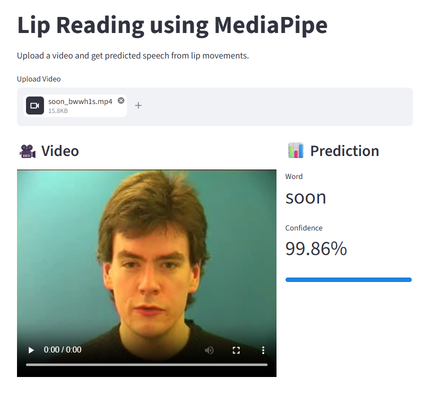

# Lip Reading using MediaPipe

This project implements a basic lip reading system using MediaPipe face mesh landmarks and an LSTM-based deep learning model.



---

## What it does

- Extracts lip landmarks from video using MediaPipe  
- Applies geometric normalization (translation, rotation, scaling)  
- Converts word segments into fixed-length sequences  
- Trains an LSTM-based model to learn temporal lip movement patterns  
- Supports:
  - Video inference  
  - GRID sentence prediction with alignment  
  - Real-time webcam inference  
  - Streamlit web app interface  

## Dataset

- GRID Corpus  
- Filtered Vocabulary: **16 words** (high-frequency classes selected)  
- Model was trained on:
  - 32 speakers  
  - 150 clips per speaker  
- Speaker-independent split:
  - 26 speakers for training  
  - 6 speakers for testing 

## Model

- LSTM-based sequence model  
- Input: sequence of normalized lip landmark coordinates
- Output: word-level classification using Softmax  

## Results

- Train Accuracy: ~**66%**  
- Validation Accuracy: ~**58%**

---

## Project Structure

    lip_reading/
    │
    ├── .env
    ├── .gitignore
    ├── requirements.txt
    ├── README.txt
    │
    ├── src/
    │   ├── analysis/
    │   │   ├── dataset_analysis.py
    │   ├── modeling/
    │   │   ├── model_loader.py
    │   │   ├── predictor.py
    │   │   └── realtime.py
    │   ├── preprocessing/
    │   │   ├── align.py
    │   │   ├── landmarks.py
    │   │   ├── pipeline.py
    │   │   └── video.py
    │   ├── utils/
    │   │   ├── dataset.py
    │   │   └── visualization.py
    │   └── config.py
    │
    ├── scripts/
    │   ├── analyze_data.py
    │   ├── extract_landmarks.py
    │   ├── predict_video.py
    │   ├── realtime_demo.py
    │   ├── save_clips.py
    │   └── visualize_landmarks.py
    │
    ├── models/
    │   └── v1/
    │
    ├── notebooks/
    │   └── train_model.ipynb
    │
    └── app.py   (Streamlit interface)


## Quick Start

1. Install dependencies  
`pip install -r requirements.txt`

2. Download the [GRID Corpus dataset](https://spandh.dcs.shef.ac.uk/gridcorpus/)

3. After downloading, extract the dataset and organize it as follows:
```
grid-corpus/
  └── data/
      ├── s1/
      ├── s2/
      │   ├── video.mpg
      │   └── align/
      │       └── video.align
```

4. Extract landmarks

All speakers:  
```
py -m scripts.extract_landmarks --data_path path/to/grid
```

Specific speakers:  
```
py -m scripts.extract_landmarks --data_path path/to/grid --speakers s1 s2
```

Range:  
```
py -m scripts.extract_landmarks --data_path path/to/grid --speakers s1-s20
```

Optional arguments:  
`--split train`  
`--num_samples 100`  
`--output_dir path/to/output`

5. Train model

Use:  
`notebooks/train_model.ipynb`

6. Run inference

GRID video:
```
py -m scripts.predict_video --model_dir models/v1 --mode grid --video_path path/to/video.mpg --align_path path/to/file.align
```

Realtime webcam:
```
py -m scripts.realtime_demo --model_dir models/v1
```

7. Run Streamlit app

```
streamlit run app.py
```

---

## Limitations

- Performance drops on unseen speakers due to limited generalization  
- Limited vocabulary (subset of GRID dataset)  
- Sensitive to lighting and face detection quality
